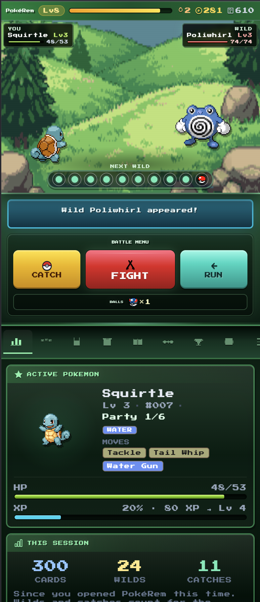
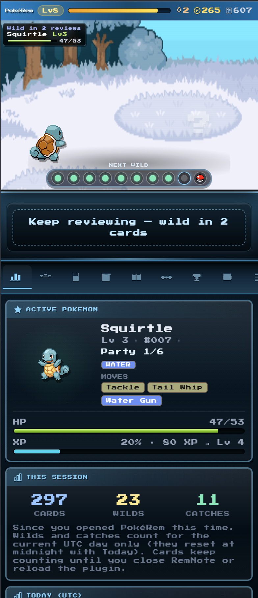
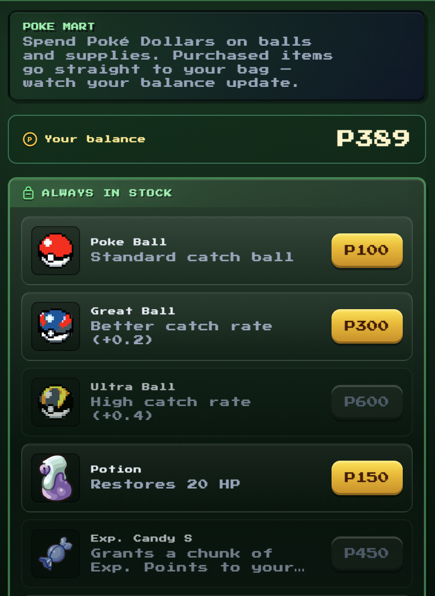
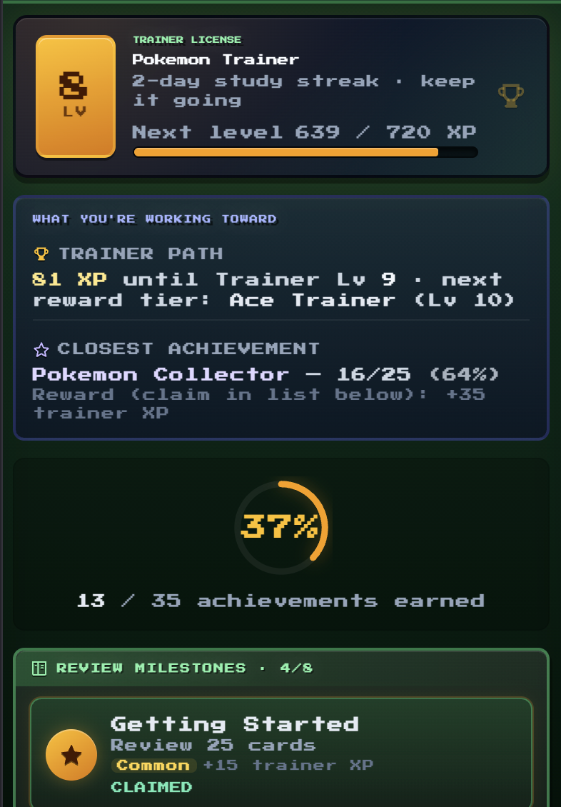
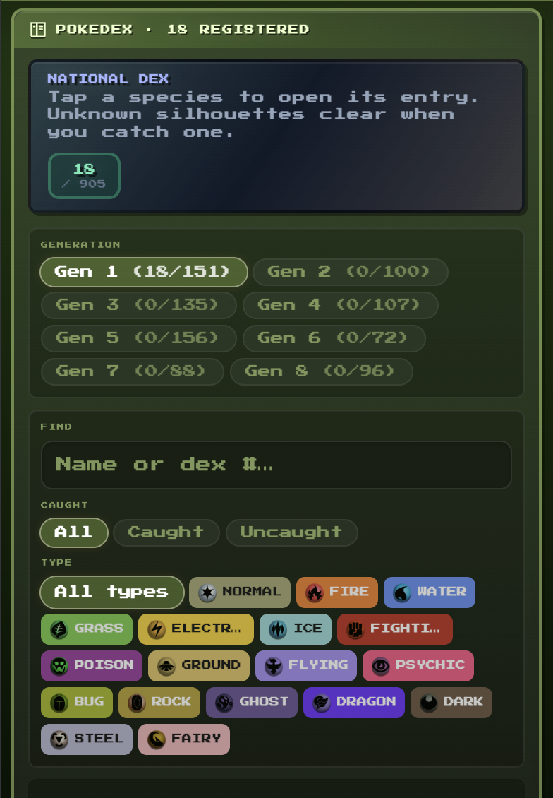

# PokéRem

PokéRem is a gamified study companion for [RemNote](https://www.remnote.com/) that turns flashcard reviews into a light progression loop: wild encounters, catching, party and bag management, a shop, type matchups, trainer levels, achievements, and a growing collection—without replacing normal review.

As you study, your queue activity drives the game. The goal is to make consistent studying feel more rewarding while RemNote stays at the center of how you learn.

## Overview

PokéRem is built directly into RemNote and is designed to sit alongside normal review rather than replace it. It adds a persistent game layer that responds to your study activity and gives you a more rewarding sense of momentum over time.

Core features include:

- wild encounter progression tied to review activity
- catching and party management
- item shop and reward systems
- trainer level and progression tracking
- achievements and collection systems
- retro-inspired battle and interface design
- persistent save data stored through RemNote plugin storage

## Why PokéRem exists

Studying is easier to sustain when progress feels visible. PokéRem was built to make review sessions feel more interactive, motivating, and satisfying while still keeping RemNote at the center of the workflow.

Instead of turning study time into a separate game, PokéRem tries to make your real study effort the thing that drives progression.

## Sidebar Screenshots (Flashcard Queue Not Shown)

<table>
  <tr>
    <td align="center">
      <strong>Encounter and battle flow</strong>  
      
    </td>
    <td align="center">
      <strong>Main study companion interface</strong>  
      
    </td>
  </tr>
  <tr>
    <td align="center">
      <strong>Shop and rewards</strong>  
      
    </td>
    <td align="center">
      <strong>Trainer progress and achievements</strong>  
      
    </td>
  </tr>
  <tr>
    <td colspan="2" align="center">
      <strong>Pokédex and collection systems</strong>  
      
    </td>
  </tr>
</table>

## Status

PokéRem is an actively developed RemNote plugin project.

The current version focuses on:
- core progression loop
- encounter and battle flow
- party, bag, shop, dex, and reward systems
- persistent save behavior
- polished in-app UI and plugin integration

## Screens and surfaces

PokéRem currently uses multiple RemNote plugin surfaces, depending on user settings and context:

- right sidebar for the main management experience
- queue-integrated surfaces for encounter and battle feedback
- optional supplementary UI such as encounter popups and queue strip elements

## Using PokéRem

### Where to open PokéRem (most users look here first)

1. Go to **Flashcard Queue** (your usual review session).
2. Tap the **AI chat** button at the **top right** of the queue to open the right **sidebar**.
3. At the **top of that sidebar**, select the **Pokéball** icon to open the PokéRem panel.

After that:

4. Choose your starter and initial study settings (first launch).
5. Review cards as normal—encounters and progression follow your review activity.
6. Catch, fight, manage your party, use the shop, and build long-term progression over time.

PokéRem is intended to complement review, not interrupt it. Sprites load from [PokeAPI](https://pokeapi.co/) when online; see `ATTRIBUTION.md` for credits and disclaimers.

## Save data

PokéRem stores its game state using RemNote plugin storage for the active knowledge base.

This includes:
- starter choice
- party and collection data
- progress toward encounters
- items, rewards, and trainer progression
- other plugin-specific save state

Backup, export, and reset-related controls are available inside the plugin.

## Project structure

| Path | Purpose |
|------|---------|
| `src/widgets/` | RemNote widget entrypoints |
| `src/game/` | Game logic, state, encounters, combat, progression |
| `src/ui/` | React UI, screens, battle surfaces, and shared components |
| `public/` | Manifest, public data, and shipped assets |
| `docs/` | Supporting project and release documentation |

## Documentation

Additional project documentation is available here:

- `docs/RELEASE_CHECKLIST.md`
- `docs/VERSIONING.md`
- `docs/ASSETS.md`
- `docs/SCOPE_AND_PRIVACY.md`
- `ATTRIBUTION.md`

## Development

Project-specific development and release documentation is available in the `docs/` folder.

## Disclaimer

PokéRem is an unofficial fan-made project. It is not affiliated with, endorsed by, or associated with Nintendo, Game Freak, or The Pokémon Company.

## License

This repository is licensed under the terms described in `LICENSE`.

Third-party notices, asset notes, and attribution details are documented in `ATTRIBUTION.md`.
